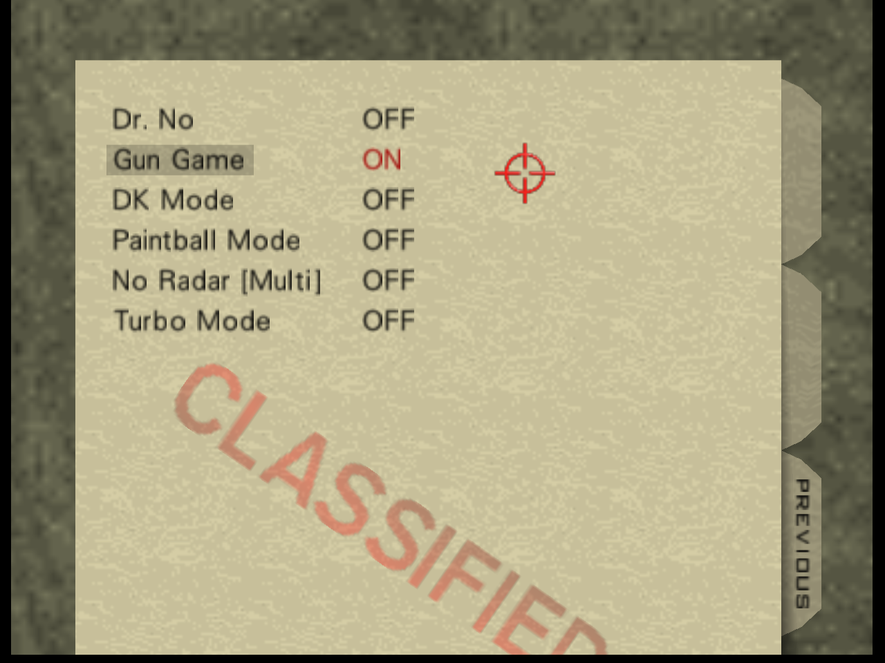
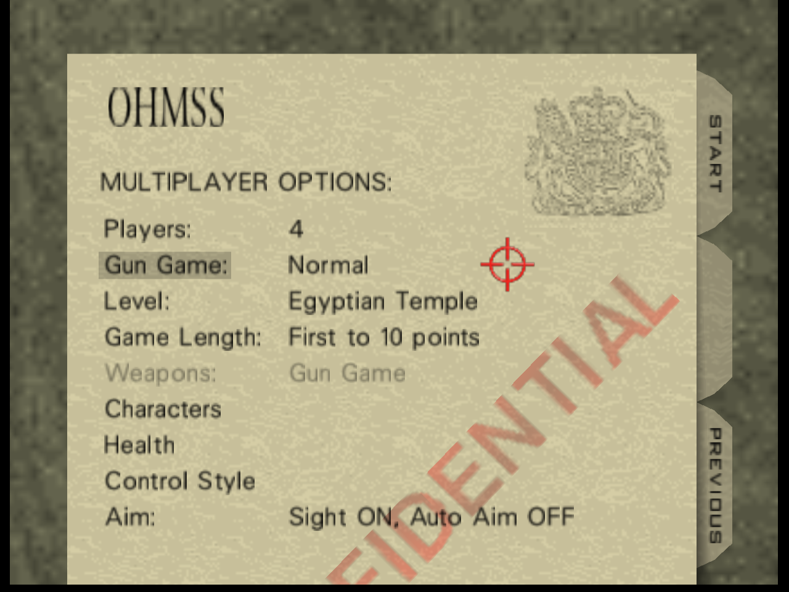
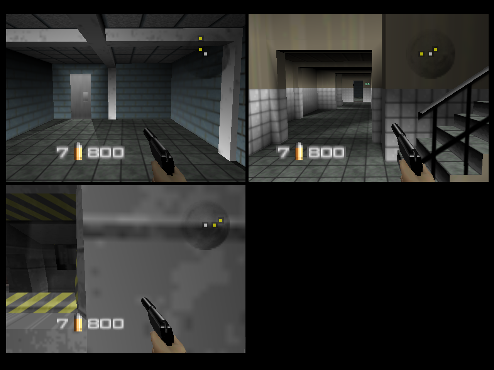
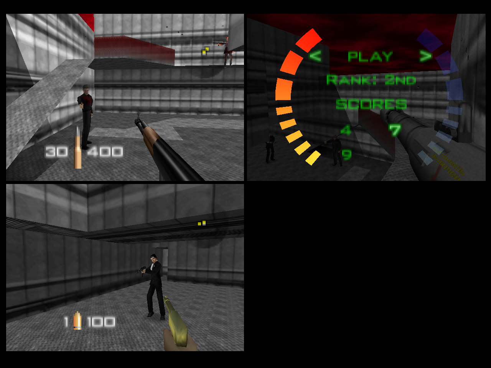

# Gun Game for GoldenEye 007 (N64)

Each players starts with a PP7, each kill moves that player up to the next gun. The winner is the first person to reach the score limit with the final weapon, the Golden Gun.

**Features:**
- Turn on and off in-game via Cheat Options
- Choose between First to 5, 10 and 20 points
- Works for all maps!
- Works for all 4 players!
- Play Cradle by holding down L in the multiplayer menu

## Gameplay

 

 

## Weapon Levels

| Level | First to 5 points | First to 10 points | First to 20 points |
| :---: | --- | --- | --- |
| 1 | PP7 Silenced | PP7 Silenced | PP7 Silenced |
| 2 | DD44 | DD44 | DD44
| 3 | Magnum | Magnum | Magnum
| 4 | Throwing Knife | Klobb | Klobb
| 5 | Golden Gun | KF7 | ZMG
| 6 | | Auto Shotgun | D5K
| 7 | | Sniper Rifle | KF7
| 8 | | Rocket Launcher | Phantom
| 9 | | Throwing Knife | AR33
| 10 | | Golden Gun | RCP90
| 11 | | | Shotgun
| 12 | | | Auto Shotgun
| 13 | | | Laser
| 14 | | | Sniper Rifle
| 15 | | | Grenade Launcher
| 16 | | | Rocket Launcher
| 17 | | | Tank
| 18 | | | Golden PP7
| 19 | | | Throwing Knife
| 20 | | | Golden Gun

## GameShark Codes Explained

I will focus mainly on the codes that make up the actual Gun Game mechanics. The rest are codes to make sure everything is unlocked, the correct settings are used, and change text in the menus e.g. instead of it saying "Unlimited Ammo" in the cheats menu it will say "Gun Game".

| Cheat | Code |
| --- | --- |
| Unlimited Ammo	| 8006965B 0001 |

As Gun Game requires max ammo it made sense to base the mode on the Unlimited Ammo cheat. This saves on adding codes to max out players ammo and also allows Gun Game to be something that can be turned on and off via the cheats menu. 

| Hook | Code |
| --- | --- |
| If Unlimited Ammo On | D00696AB 0001 |

Using `D0` gameshark codes we can make sure the codes we want to run only run when the cheat has been turned on. There are many other `D0` codes that will be used.

| Hook | Code |
| --- | --- |
| If In Game | D002A8C3 000B |
| If 3 Player | D002B523 0003 |
| If 4 Player | D002B523 0004 |
| If First to 5 points| D002B53B 0004 |
| If First to 10 points | D002B53B 0005 |
| If First to 20 points | D002B53B 0006 |
| If P1 Kills xx | D0079F0F 00 xx |
| If P2 Kills xx | D0079F7F 00 xx |
| If P3 Kills xx | D0079FEF 00 xx |
| If P4 Kills xx | D007A05F 00 xx |

The next codes are to check which level has been loaded, this is important as some codes will be different depending on what level is loaded.

| Hook | Code |
| --- | --- | 
| If Temple	|D002A8F7 0026 |
| If Complex	| D002A8F7 001F |
| If Caves	| D002A8F7 0032 | 
| If Library	| D002A8F7 0030 |
| If Basement	| D002A8F7 002D |
| If Stack	| D002A8F7 002E |
| If Facility	| D002A8F7 0022 |
| If Bunker	| D002A8F7 001B | 
| If Archives	| D002A8F7 0018 |
| If Caverns | D002A8F7 0027 |
| If Egyptian	| D002A8F7 0020 |
| If Cradle	| D002A8F7 0029 |

Another possible hook for this could be `D002B537 00` which is the map chosen in the Multiplayer Menu but this fails when Random is selected.

| Weapon Modifier | Temple |	Bunker | Caverns	| Facility | Archives | Cave | Egyptian |
| :---: | --- | --- | --- | --- | --- | --- | --- |
| Player 1 | 800A7C0F 00 | 800B940F 00 | 800C5C0F 00 | 800C840F 00 | 800CD40F 00 | 800D9C0F 00 | 800F2C0F 00 |
| Player 2  | 800AA68F 00 | 800BBE8F 00 | 800C868F 00 | 800CAE8F 00 | 800CFE8F 00 | 800DC68F 00 | 800F568F 00 |
| Player 3  | 800AD10F 00 | 800BE90F 00 | 800CB10F 00 | 800CD90F 00 | 800D290F 00 | 800DF10F 00 | 800F810F 00 |
| Player 4  | 800AFB8F 00 | 800C138F 00 | 800CDB8F 00 | 800D038F 00 | 800D538F 00 | 800E1B8F 00 | 800FAB8F 00 |

The weapon modifier code is main drive behind the Gun Game mechnanics as it changes what gun the player has in their inventory. However until a player respawns or presses A to switch weapon, their current gun will remain the same.

It is important to note that the codes used for Temple are also used for Complex, Library, Stack and Basement and the code for Archives is also used for Cradle (unavailable unless using cheats).

| Weapon | ID |
| --- | :---: |
| Slapper	| 01 | 
| Fighting Knife | 02 |
| Throwing Knife	| 03 | 
| PP7 |	04 | 
| PP7 Silenced |	05 |
| DD44	| 06 | 
| Klobb| 	07 | 
| KF7	| 08 |
| ZMG	| 09 |
| D5K	| 0A |
| D5K Silenced | 0B |
| Phantom	| 0C |
| AR33 | 0D |
| RCP90	| 0E | 
| Shotgun	| 0F |
| Auto Shotgun	| 10 |
| Sniper Rifle | 11 |
| Magnum | 12 |
| Golden Gun | 13 | 
| Silver PP7 | 14 |
| Gold PP7 | 15 |
| Laser	| 16 |
| Watch Laser	| 17 |
| Grenade Launcher | 18 |
| Rocket Launcher | 19 |
| Hand Grenades	| 1A | 
| Timed Mines | 1B |
| Proximity Mines	| 1C |
| Remote Mines | 1D |
| Watch Button | 1E |
| Taser | 1F |
| Tank Shells	| 20 |

The weapon IDs to be paired with the weapon modifier codes.

## Issues

* The weapon change isn't automatic, players will need to press A to go to their next weapon. If they die they will respawn with the correct weapon.

* It doesn't take suicides (-1 point) into consideration so you won't go down a gun level if you die from your own explosion, instead you'll need to get extra kills with the Golden Gun to make up the difference.

* Project64 sometimes won't start a game if cheats are enabled. Opening and closing the cheats menu will fix this.

* It's a lot of codes... in fact so many it does not play smoothly with [Triclon's Nintendo 64 Gameshark Code Injector](https://www.romhacking.net/utilities/1659/) 

## Console

A reduced version (can only play the maps Temple, Complex, Library, Basement and Stack) intended for console play via a flash cart is available as a [BPS patch](/Console/Gun%20Game%20Patch.bps). This uses Triclon's Nintendo 64 Gameshark Code Injector so it requires you to have an expansion pak to play.
